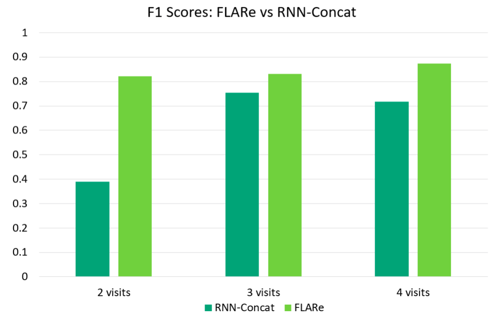

## FLARe : Feature Learning using Anticipated Representations

<center>Surya Teja Devarakonda*, Joie Yeahuay Wu*, Yi Ren Fung, Madalina Fiterau</center>

[Paper]

<center><italics>University of Massachusetts, Amherst</italics></center>

#### Machine Learning For Healthcare, MLHC 2019 

### Abstract
Computational models that forecast the progression of Alzheimer’s disease at the patient
level are extremely useful tools for identifying high risk cohorts for early intervention and
treatment planning. The state-of-the-art work in this area proposes models that forecast
by using latent representations extracted from the longitudinal data across multiple modalities, including volumetric information extracted from medical scans and demographic info.
These models incorporate the time horizon, which is the amount of time between the last
recorded visit and the future visit, by directly concatenating a representation of it to the
latent data representation. In this paper, we present a model which generates a sequence
of latent representations of the patient status across the time horizon, providing more informative modeling of the temporal relationships between the patient’s history and future
visits. Our proposed model outperforms the baseline in terms of forecasting accuracy and
F1 score.

<center>

</center>

### Results
We report our results partitioned over all time horizons (tau) and number of data points used (T):

<center>

</center>

## Documentation
### Data
We used data from the [TADPOLE challenge](https://tadpole.grand-challenge.org/Data/#Data). Specifically, we used the **TADPOLE_D1_D2.csv** file. Download that file and save it in the directory *data/*. 

### Instructions
Python version used = 3.6.5 
All library requirements are in **requirements.txt**  
1. Create an environment with the correct version of python.  
2. Install all dependencies by running the following command:
	```
	python -r requirements.txt
	```

### Feature Extraction
In **TADPOLE_D1_D2.csv** file, each row contains the data corresponding
 to a single visit of a patient.   

For each visit of a patient, we extract the following features:  
- **Image Features:** 692 columns representing MRI biomarkers, which can be 
found in the columns containing UCSFFSX (cross-sectional) and UCSFFSL (longitudinal). 
- **Cognitive Assessment Features:** ADAS11, CDRSB, MMSE, RAVLT_immediate
- **Structured Covariate Features:** AGE, PTGENDER, APOE4  

### Training
The experiment parameters can be set using the configuration file present
in the folder *configs/*. Please refer to the default config file, 
*configs/config.yaml*, for details about the model parameters. 

The **main.py** file in the *scripts/* directory contains the code that does
the following: 
1. Creates an experiment directory in the *outputs/* folder.  
2. Creates a pickle object for the data named **data.pickle** (which is stored
in the *data/* directory), that stores the features extracted from the 
**TADPOLE_D1_D2.csv** file in a structured manner, to be later used for 
training. This will be a one-time process, and the **data.pickle** file will 
be loaded for all future experiments.  
3. Trains the model.
4. Evaluates the model. 

Thus, the model can be trained by doing the following:  
	1. Set train_model = True in config.yaml.  
	2. Run the command:   
	```
	python main.py --config=../configs/config.yaml  
	```

### Experiment Outputs
The config file requires an ID to be assigned to the present experiment. This
is used to create a folder in the *outputs/* directory, which stores all the 
checkpoints, logs and results of that experiment.  

After training, the model weights are saved in the directory 
*outputs/<exp_id>/checkpoints/*.  
The loss graphs are stored in the directory 
*outputs/<exp_id>/logs/*.   
The evaluation confusion matrices are stored in the directory 
*outputs/<exp_id>/results/*.

### Evaluation
The model can be evaluated on the train, validation, and test datasets by 
doing the following:  
	1. Set train_model = False and test_model = True in config.yaml.  
	2. Run the command:  
	```
	python main.py --config=../configs/config.yaml  
	```

The results are stored in the directory *outputs/<exp_id>/results/*. 

We uploaded the experiment folder **flare_pretrained/** with the best results [here](https://www.dropbox.com/sh/vgrj13a1f0cmmcx/AADm4aHGMbLK7bCc29dsoVqma?dl=0). The model 
can be initialized with these pretrained weights by setting  
model.load_model: '../outputs/flare_pretrained/checkpoints/model.pth'  
in the config file. 


